## Requirements for Assignment-1
[Read the instruction](https://github.com/STIW3054-A212/Assignments_and_Project/blob/main/Assignment-1.md)

## Your Info:
Name : Rizky Nakami Afif

Matric : 274862

Phone : 011558562485

## Introduction
This is a small project aimed at developing using Maven to read and extract data from files. This program is designed to read the list of practicum students and their supervisors and finally find RealTime courses among them and display Realtime details.

## Flow Diagram of the requirements
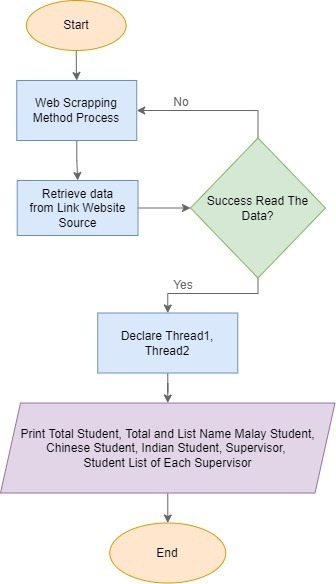
## User manual/guideline for using the system

## Result/Output (Screenshot of the output)
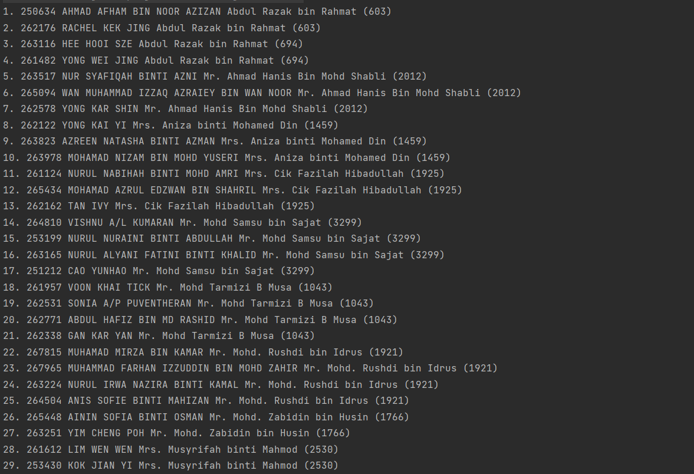
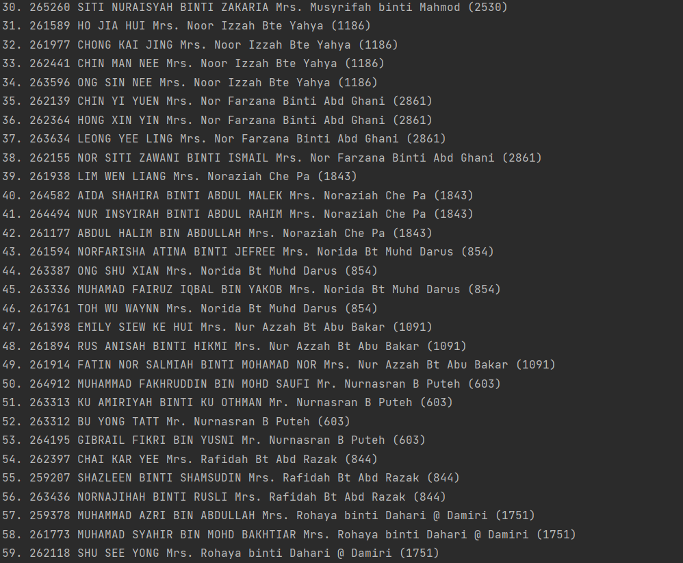
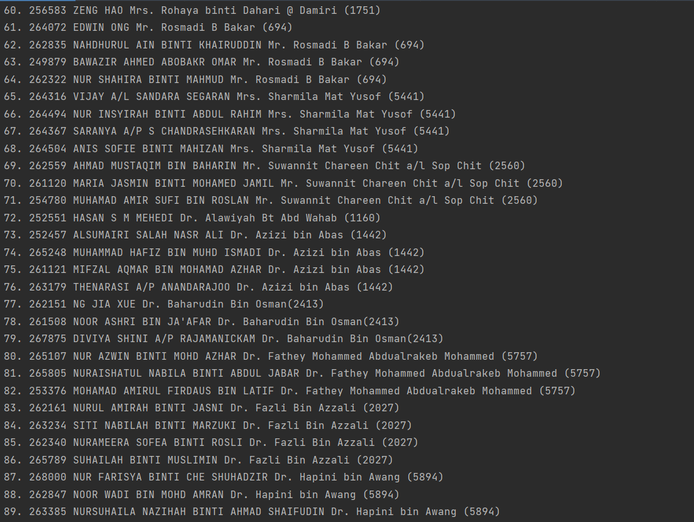
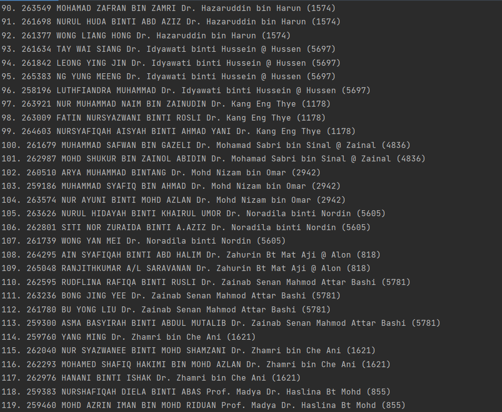
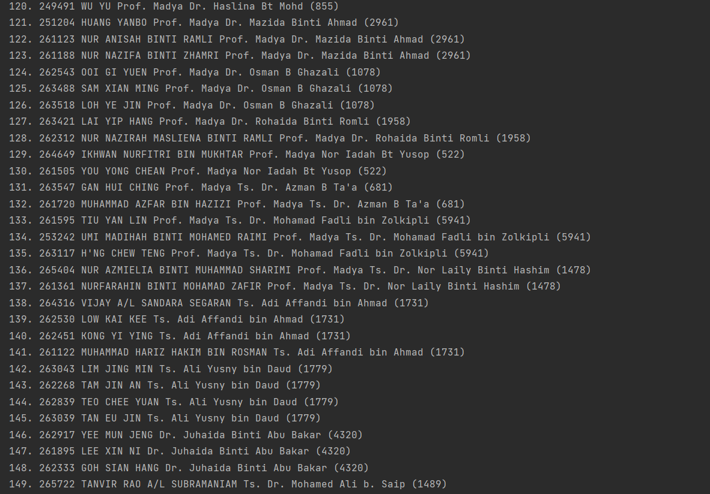
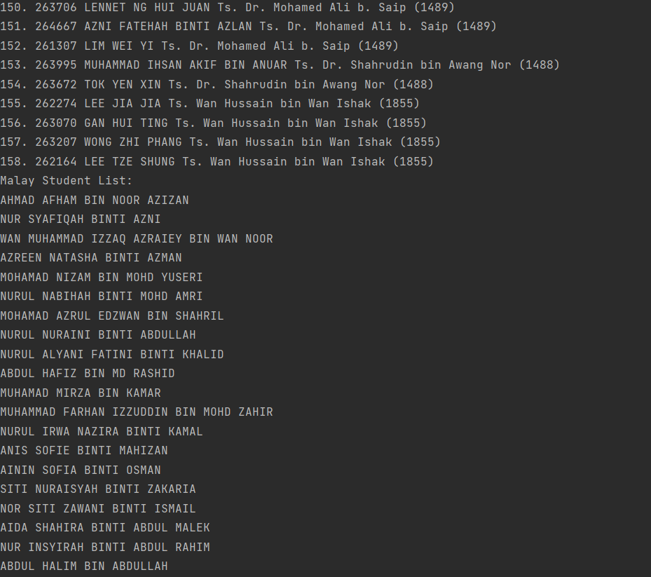
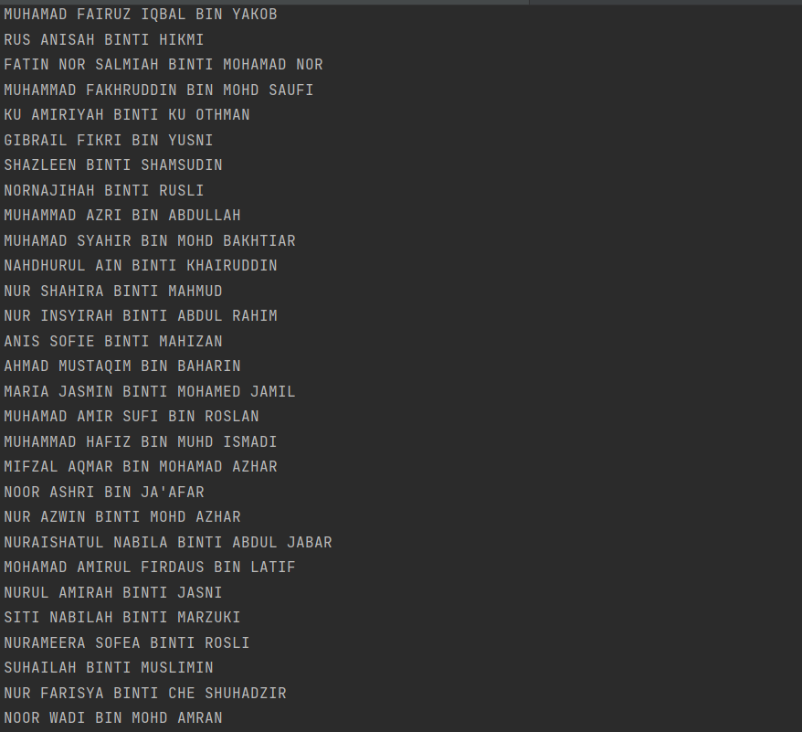
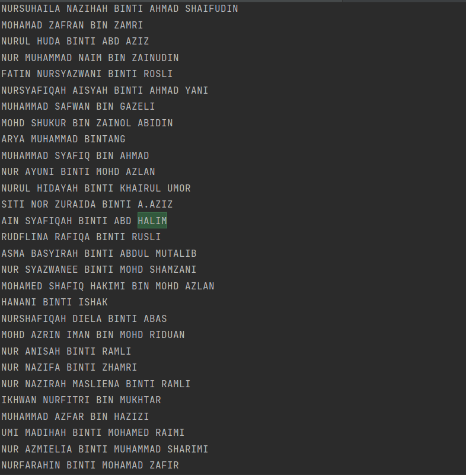
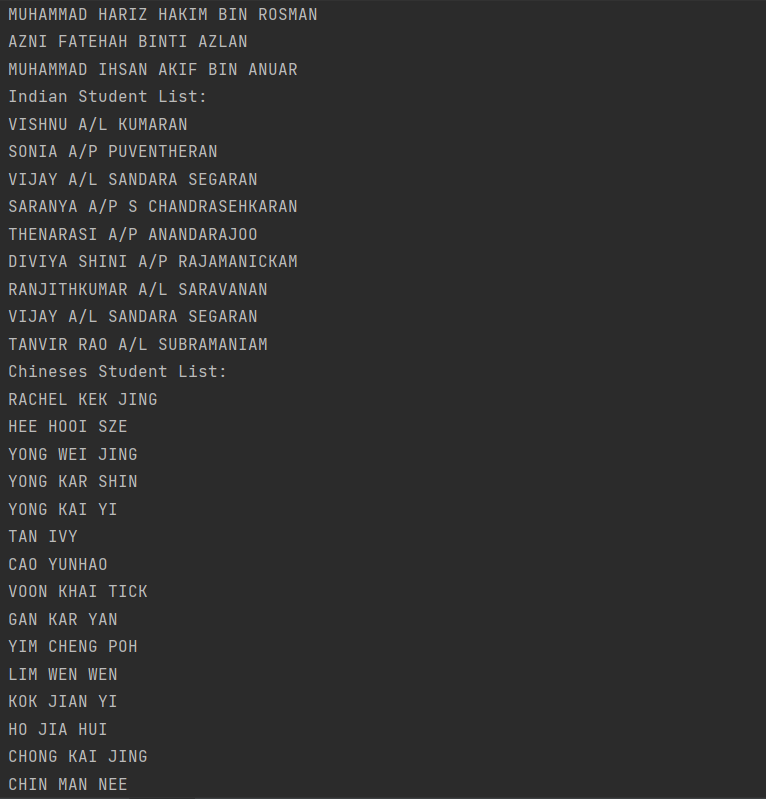
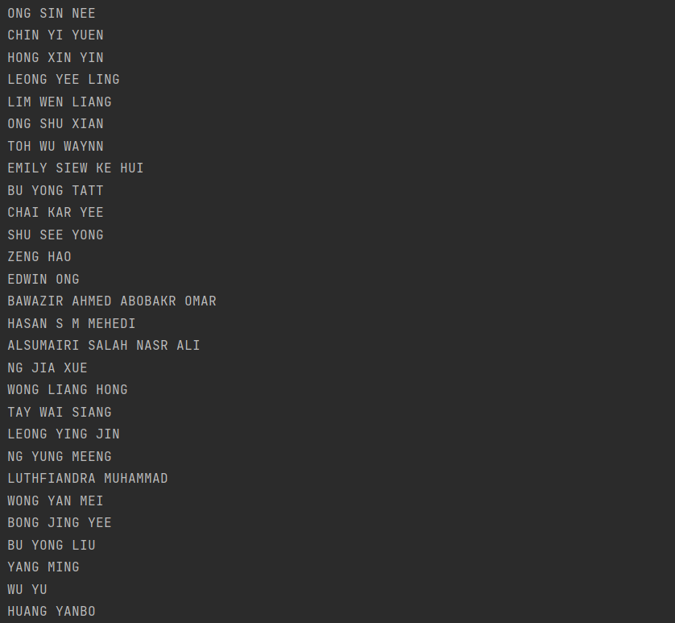
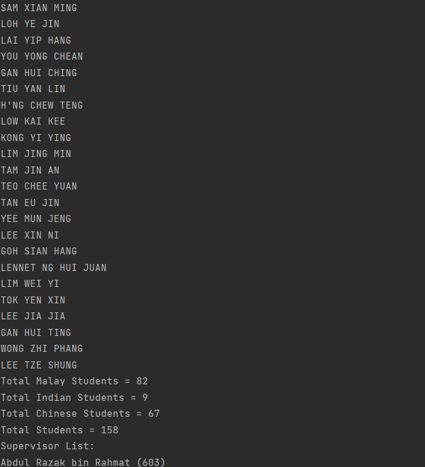
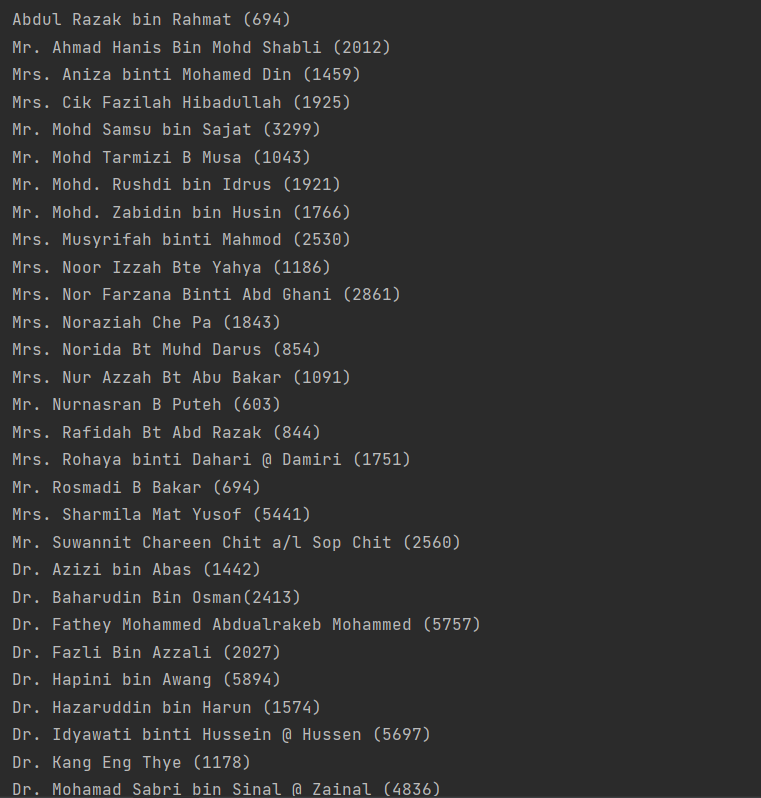
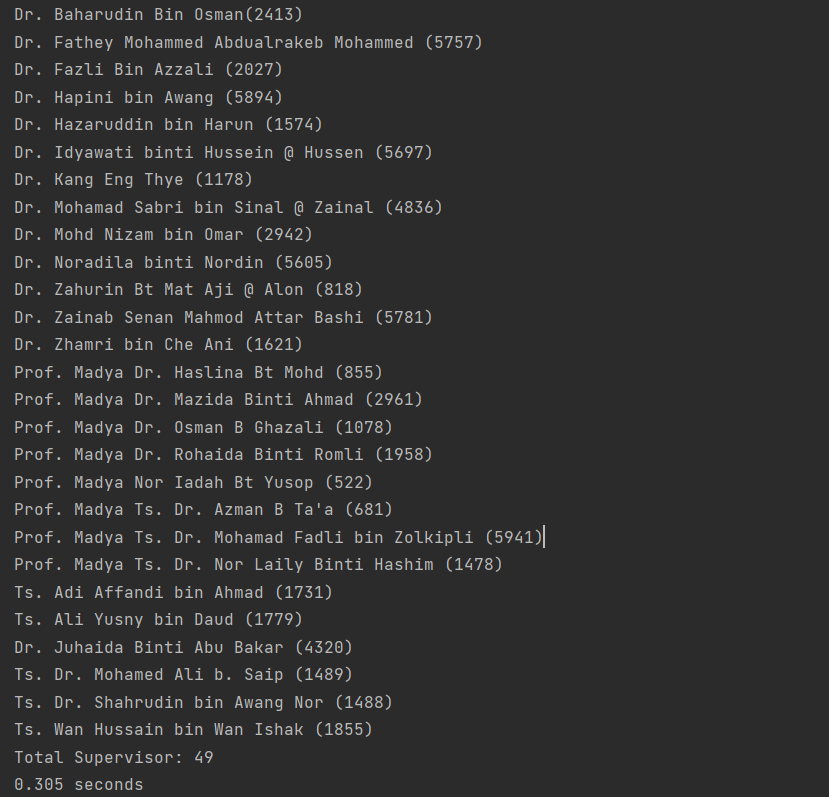
## UML Class Diagram
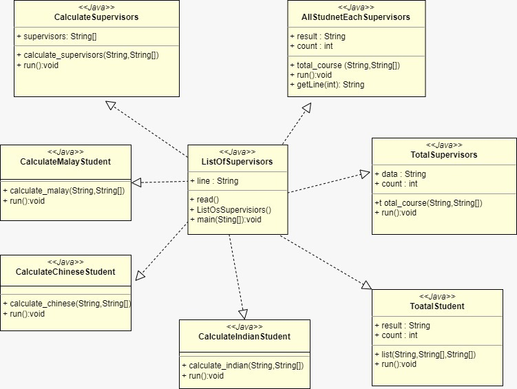
## Youtube Presentation
## References (Not less than 10)

Introduction to Web Scraping with Java | Java Tutorial | Web Scraping Tutorial
https://www.youtube.com/watch?v=1a7esDg4JQY

How to make web scraping with java :
https://www.youtube.com/watch?v=tI1qGwhn_bs

Measure elapsed time (or execution time) in Java :
https://www.techiedelight.com/measure-elapsed-time-execution-time-java/

Compute elapsed time in seconds in Java:
https://www.tutorialspoint.com/compute-elapsed-time-in-seconds-in-java
## JavaDoc
